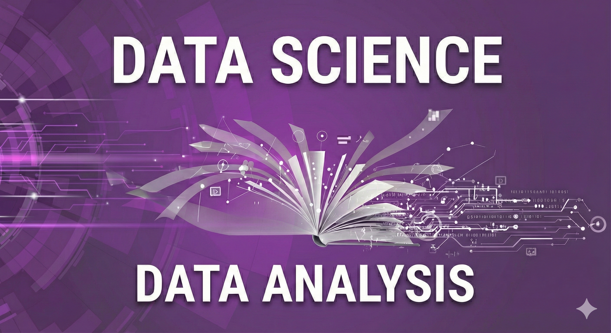

   

  

I’m Rafael. I have a Bachelor’s and a Master’s degree in Mathematics, and I am now transitioning into the Data field. I want to use my analytical background to work with data and create clear and meaningful insights.

I study data analysis using Python, working mainly with Pandas, Matplotlib and Seaborn. My work involves exploring datasets, cleaning information and creating visualizations to uncover patterns. I am also beginning to study Data Science, and learning how data analysis helps build better models as I grow in this field.

My years as a teacher helped me develop strong communication, problem-solving and attention to detail. These skills support my work as I build new data projects and continue growing in this field.

Thank you for visiting my GitHub.

**Background in:** Python, Pandas, Matplotlib, Seaborn, Statistics

**Links:**
* [LinkedIn](https://www.linkedin.com/in/rafael-vieira-bonangelo/)

## Projetos:
My projects:
